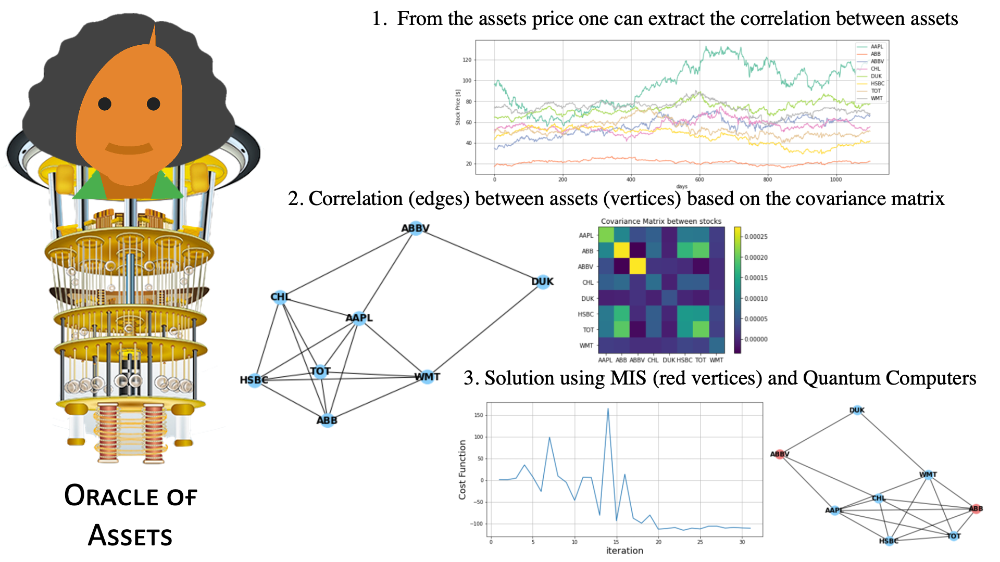

# Oracle Of Assets
The oracle of assets is a tool for investors that identifies a subgroup of assets that minimize the risk to lose money. Using neutral atoms, we can identify such a subgroup using an algorithm known as Maximum Independent Set (MIS). The subgroup of assets will not share a correlation between them, therefore if the price in the market of one of the assets decreases it won't affect the price of the others. Our algorithm will ensure that the subgroup will have the greater variety of assets possible for an investor to invest in.

## 1. Asset prices

We select 8 stocks from 8 conglomerates based on the work from Xu et al. [2]:

- Basic Materials: TOTAL S.A. "TOT"

- Consumer Goods: Appel Inc. "AAPL"

- Healthcare: AbbVie Inc. "ABBV"

- Services: Wall-Mart Stores Inc. "WMT"

- Utilites: Duke energy corporation "DUK"

- Financial: HSBS Holding pcl "HSBC"

- Industrial Goods: ABB Ltd. "ABB"

- Technology: China Mobile Limited "CHL"

The information comes from Sep 2012 to Sep 2017 with daily Technical information of Open, High, Low, Close, Adj Close, and Volume for the stocks price.

## 2. Covariance Matrix

To know how strong is the correlation between two stocks, we use the [covariance matrix](https://en.wikipedia.org/wiki/Covariance_matrix). If the correlation between the two stocks exceeds a **threshold** during a period of time it means they are connected. We use a graph representation to show such a correlation as an edge between two nodes (the stocks). 

## 3. The solution

Now, We want to know which subset in this graph is the maximal independent set. This means, which subgroup of assets does not share the connection between them. This is important in portfolio optimization because we want to minimize the risk to lose money by the so call **"putting all the eggs in the same basket"**, if we have a diverse portfolio is hard we lose because one market is affected by some situation.

In this solution, we present the results using the Quantum Approximate Optimization algorithm ([QAOA](https://en.wikipedia.org/wiki/Quantum_optimization_algorithms)) and the Quadratic Unconstrained Binary Optimization ([QUBO](https://en.wikipedia.org/wiki/Quadratic_unconstrained_binary_optimization))on a gate-based quantum device.

To this end, we use [Bloqade](https://queracomputing.github.io/Bloqade.jl/dev/) for the neutral atoms and Qiskit and its library of **qiskit_optimization** to solve the MIS problem.
