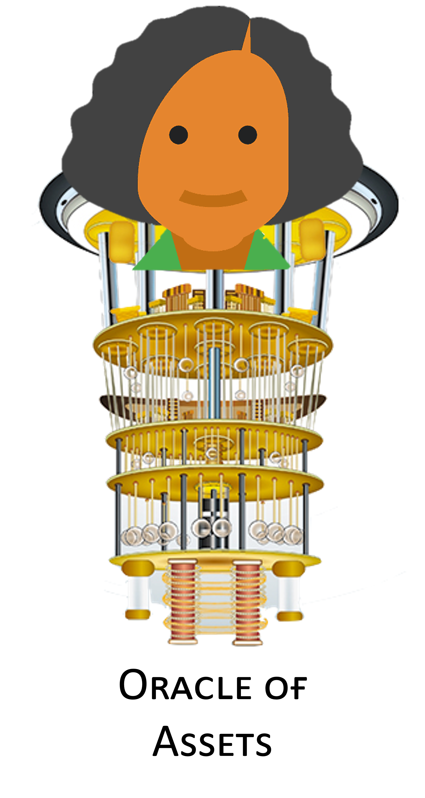

# Oracle Of Assets
The oracle of assets is a tool for investors that identifies a subgroup of assets that minimize the risk to lose money. Using neutral atoms, we can identify such a subgroup using an algorithm known as Maximum Independent Set (MIS). The subgroup of assets will not share a correlation between them, therefore if the price in the market of one of the assets decreases it won't affect the price of the others. Our algorithm will ensure that the subgroup will have the greater variety of assets possible for an investor to invest in.

